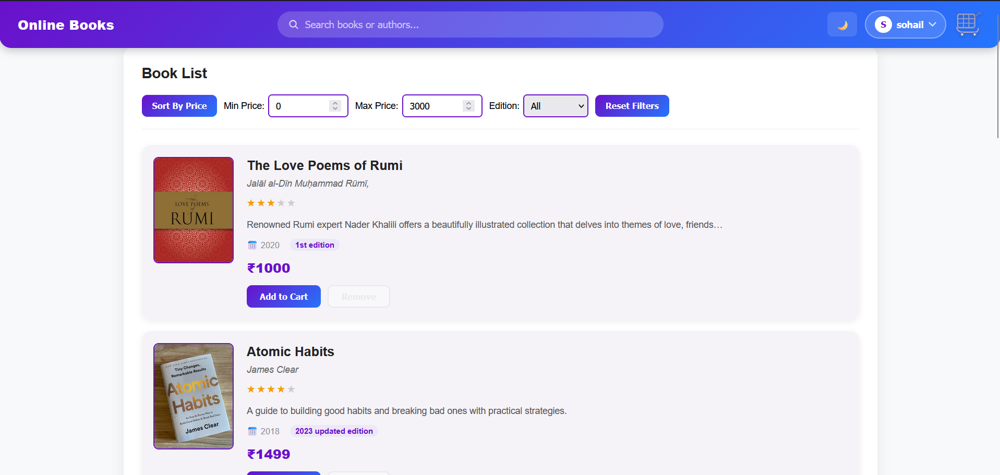
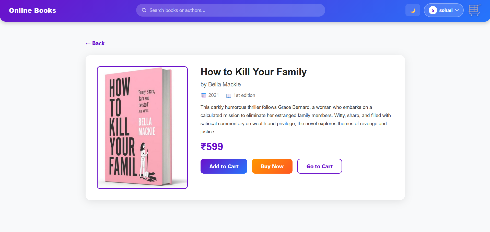
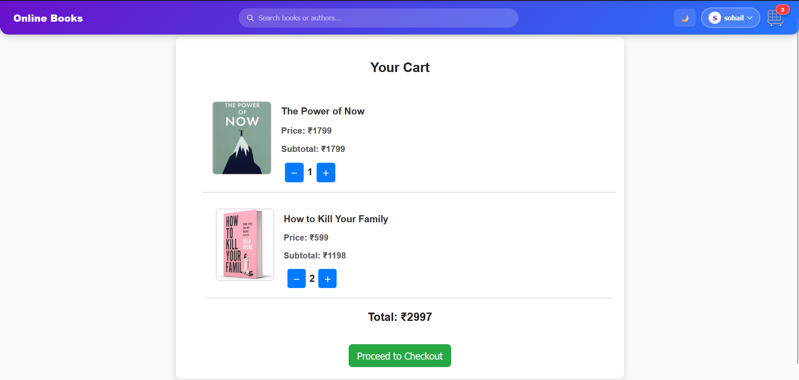
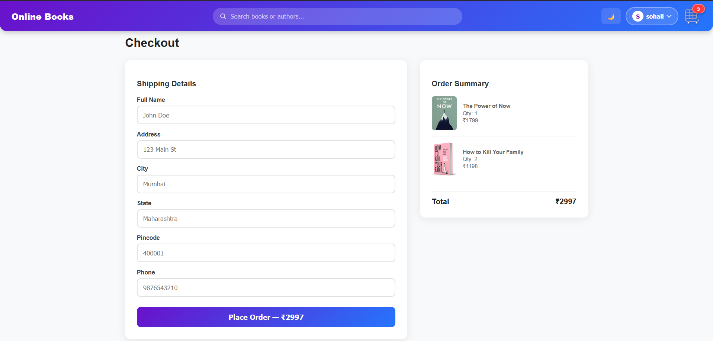
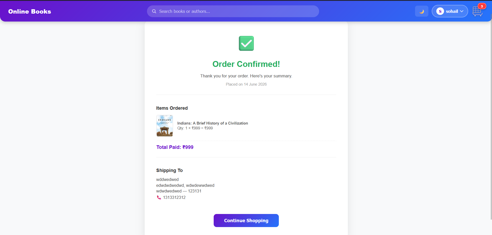

# 📚 Online Books

A full-stack e-commerce web application for browsing, searching, and purchasing books online. Built with **React**, **Node.js**, **Express**, and **MongoDB**.

---

## ✨ Features

### 🛍️ Shopping
- Browse a curated collection of books
- Product detail page with full description, edition, and publish year
- Add to Cart / Remove from Cart with live quantity tracking
- Cart persisted in `localStorage` — survives page refresh
- "Buy Now" — adds to cart and jumps straight to checkout

### 🔍 Search & Filter
- Live search bar (client-side, instant, no extra network requests)
- Filter by price range (min/max)
- Filter by edition
- Sort by price (ascending toggle)
- All filters work together composably — no conflicts

### 🔐 Authentication
- Register / Login with JWT-based auth
- Passwords hashed with bcrypt
- Auth state persisted in `localStorage`
- Protected routes (checkout, orders) redirect to login

### 🧾 Checkout & Orders
- Shipping address form with validation (phone, pincode)
- Real order placed to backend with full item and address data
- Order confirmation page with summary
- Order history page listing all past orders with status badges

### 🎨 UI / UX
- Skeleton loader while books are fetching
- Empty state SVG illustrations for "no results" and "empty cart"
- Toast notifications for all cart and auth actions
- Dark mode toggle
- Responsive layout (mobile-friendly)
- Per-page browser tab titles (`Book Title — Online Books`)
- Animated dropdown account menu with order history link

## 📸 Screenshots

### Home Page


### Product Details


### Shopping Cart


### Checkout


### Order Confirmation


---

## 🗂️ Project Structure

```
E-commerce2/
├── backend/
│   ├── middleware/
│   │   └── auth.js          # JWT verification middleware
│   ├── models/
│   │   ├── User.js          # User schema (bcrypt password hashing)
│   │   └── Order.js         # Order schema with items + shipping
│   ├── routes/
│   │   ├── authRoutes.js    # POST /register, POST /login, GET /me
│   │   └── orderRoutes.js   # POST /orders, GET /myorders, GET /:id
│   ├── .env                 # Environment variables (not committed)
│   ├── package.json
│   └── server.js            # Express app entry point
│
└── frontend/
    ├── public/
    │   └── index.html
    ├── src/
    │   ├── components/
    │   │   ├── Header.jsx       # Sticky header with search, dropdown, cart
    │   │   ├── ProductItem.jsx  # Individual book card
    │   │   ├── ProductList.jsx  # Book listing with filters + skeleton
    │   │   └── ProtectedRoute.jsx
    │   ├── context/
    │   │   ├── authContext.js   # Auth state (login/register/logout)
    │   │   └── itemContext.js   # Products, cart, search (all client-side)
    │   ├── hooks/
    │   │   └── usePageTitle.js  # Dynamic document.title per page
    │   ├── pages/
    │   │   ├── Cart.jsx
    │   │   ├── Checkout.jsx
    │   │   ├── Login.jsx
    │   │   ├── NotFound.jsx
    │   │   ├── OrderConfirmation.jsx
    │   │   ├── OrderHistory.jsx
    │   │   ├── ProductDetail.jsx
    │   │   └── Register.jsx
    │   ├── App.js
    │   └── App.css
    └── package.json
```

---

## 🚀 Getting Started

### Prerequisites
- Node.js ≥ 18
- MongoDB running locally (or Atlas connection string)

### 1. Clone the repo

```bash
git clone https://github.com/sohail-148/Online-Books.git
cd Online-Books
```

### 2. Backend setup

```bash
cd backend
npm install
```

Create a `.env` file in `backend/`:

```env
PORT=5000
MONGO_URI=mongodb://127.0.0.1:27017/newdatabase
JWT_SECRET=your_secret_key_here
JWT_EXPIRES_IN=7d
```

Start the server:

```bash
npm start
```

The backend seeds the database automatically on first run if it's empty.

### 3. Frontend setup

```bash
cd frontend
npm install
```

Create a `.env` file in `frontend/`:

```env
REACT_APP_API_URL=http://localhost:5000
```

Start the dev server:

```bash
npm start
```

Open [http://localhost:3000](http://localhost:3000)

---

## 🔌 API Endpoints

### Books
| Method | Endpoint | Description |
|--------|----------|-------------|
| GET | `/api/books` | Get all books |
| GET | `/api/books/:id` | Get book by ID |
| POST | `/api/books` | Add a new book |
| PUT | `/api/books/:id` | Update a book |
| DELETE | `/api/books/:id` | Delete a book |

### Auth
| Method | Endpoint | Description |
|--------|----------|-------------|
| POST | `/api/auth/register` | Register a new user |
| POST | `/api/auth/login` | Login and receive JWT |
| GET | `/api/auth/me` | Get current user (auth required) |

### Orders
| Method | Endpoint | Description |
|--------|----------|-------------|
| POST | `/api/orders` | Place an order (auth required) |
| GET | `/api/orders/myorders` | Get current user's orders (auth required) |
| GET | `/api/orders/:id` | Get single order (auth required, owner only) |

---

## 🛠️ Tech Stack

| Layer | Technology |
|-------|-----------|
| Frontend | React 19, React Router v7, react-hot-toast |
| State | React Context API + localStorage |
| Backend | Node.js, Express 4 |
| Database | MongoDB + Mongoose |
| Auth | JWT + bcryptjs |
| Styling | Plain CSS (custom, no framework) |

---
## 📝 Environment Variables

### Backend (`backend/.env`)
| Variable | Description |
|----------|-------------|
| `PORT` | Server port (default: 5000) |
| `MONGO_URI` | MongoDB connection string |
| `JWT_SECRET` | Secret key for signing JWTs |
| `JWT_EXPIRES_IN` | JWT expiry (e.g. `7d`) |

### Frontend (`frontend/.env`)
| Variable | Description |
|----------|-------------|
| `REACT_APP_API_URL` | Backend base URL (default: http://localhost:5000) |

---

## 📄 License

MIT
